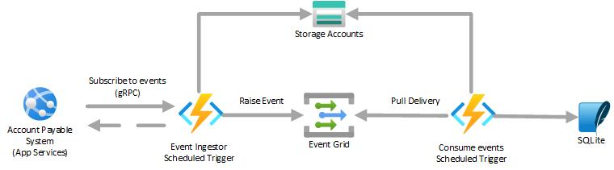
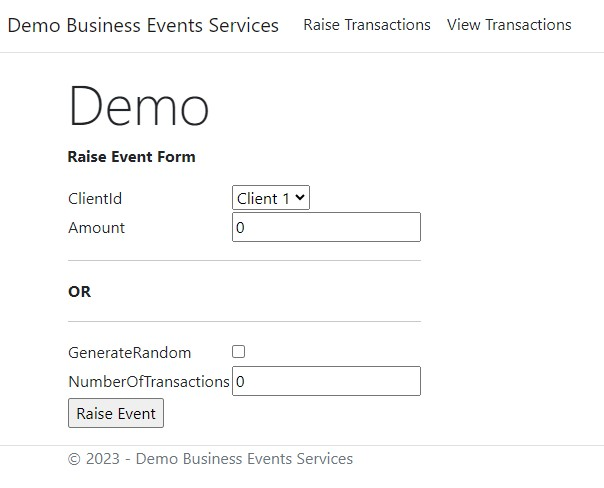
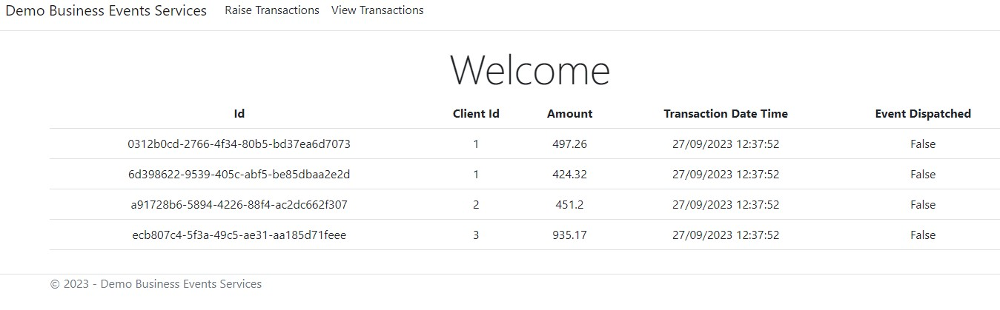
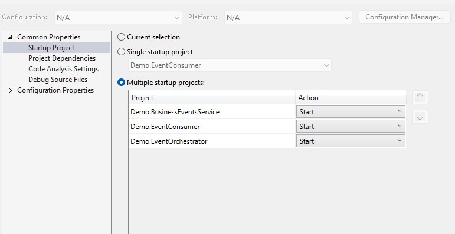

# Event handling using Azure Event Grid Pull model delivery
## Introduction  

The purpose of this demo is to show how Azure Function and Event Grid's Pull delivery model can be used to pulled events from gRPC enabled endpoint and then consume events.

  
## Scenario  

ABC company uses APS (Accounts Payable System) which is SaaS, to payout invoices for their customers. The payout details needs to synced to custom built CRM application which is hosted in Azure.

APS system raises events for every transaction and inforfmation in event can be more then 1 MB in size. APS system exposes enpoint which is based on gRPC to which applications can subscribe to receive events.

## Solution  

In our solution we will be using Azure Functions and Event Grid to consume events. Using claim check pattern will be better option as payload size of event raised by APS system can be more than 1 MB.

There will be two Azure Function apps. Function App for Event Orchestration will subscribe to APS gRPC based endpoint and save event payload in Blob storage and push event containg payload file name to Event Grid's custom topic. These events will then be consumed and processed by second function app using pull delivery.

<b>Note:</b> For the sake of demonstration, in our solution we will be using SQLite (in-memory) to store infomration.

## Prerequistes
* Azure Subscription
* Visual Studio 2022
## Azure Components
* App Service
* Function App
* Event Grid (Required)
* Storage account  (Required)

## Solution Layout
|Project|Details|
|-----|-----|
|Demo.BusinessEventsService|Asp.Net MVC which implements gRPC based service and User Infterface for management.|
|Demo.EventOrchestrator|Function app which pulls events from Demo gRPC service and raise events in Event Grid.|
|Demo.EventConsumer|Function app which demonstrates pull delivery functionality of Event Grid.|  
## Deployment  

Please note, you can run solution locally using Visual Studio 2022 without creating anyother resources. Hoeverever Event Grid is mandatory.

- Create Event Grid namespace custom events, topic and event subscription using following tutorials
    - Create Event Grid namepsace for custom events <a href="https://learn.microsoft.com/en-us/azure/event-grid/event-grid-dotnet-get-started-pull-delivery#create-a-namespace-in-the-azure-portal">link</a>.
    - Create a namespace topic <a href="https://learn.microsoft.com/en-us/azure/event-grid/event-grid-dotnet-get-started-pull-delivery#create-a-namespace-topic">link</a>.
    - Create event subscription <a link="https://learn.microsoft.com/en-us/azure/event-grid/event-grid-dotnet-get-started-pull-delivery#create-an-event-subscription">link</a>.
- Create Storage account with blob container.
- Creat App service.
- Create 2 Function Apps, one for Demo.EventOrchestrator and another for Demo.EventConsumer.  

## Project environment settings  
### Demo.EventConsumer  
|Variable Name|Details|
|-----|-----|
|AEG_TOPIC_ENDPOINT|endpoint of event grid custom topic e.g https://xxx.eastus-1.eventgrid.azure.net|
|AEG_TOPIC_KEY|Event grid Custom Topic Key|
|AEG_TOPIC_NAME|Name of event grid custom topic|
|AEG_TOPIC_SUBSCRIPTION|Event grid custom topic subscription name|
|BLOB_CONNSTR|Connection string of storage account|
|BLOB_CONTAINER_NAME|Name of blob container. Note: if container does not exists code will create it.|
### Demo.EventOrchestrator  
|Variable Name|Details|
|-----|-----|
|AEG_TOPIC_ENDPOINT|endpoint of event grid custom topic e.g https://xxx.eastus-1.eventgrid.azure.net|
|AEG_TOPIC_KEY|Event grid Custom Topic Key|
|AEG_TOPIC_NAME|Name of event grid custom topic|
|SERVICE_API_ENDPOINT|End point of app service where Demo.BusinessEventsService is deployed.|
|BLOB_CONNSTR|Connection string of storage account|
|BLOB_CONTAINER_NAME|Name of blob container. Note: if container does not exists code will create it.|  

## How to Run and Test
<b>Create Transactions via UI</b>

Navigate to Demo.BusinessEventsService url and you will see below landing screen. You can either raise transactions indivudually or generate random events by specifying NumberOfTransactions. The service enpoint will deliver these transactions to the client when requested.

 
<b>View Transactions</b>

To view transactions and track their delivery click on "View Transations". Screen shot for reference below. "Event Dispatched" column will indicate if the transaction has been relayed to client or not.

 

<b>View Event Orchestrator and Event Consumer</b>

You can view the log information in both function Monitoring in Azure or in Visual Studio console window to see the activity. Screen shot of functions running locally below.
 
 

## How to Run using Visual Studio 2022

<b>Note:</b> Using Visual Studio 2022, you will need to select all projects to start at the same time or you can start each indivually. If you are starting indivudually first start Demo.BusinessEventsService. Please see screen shot below 

 
