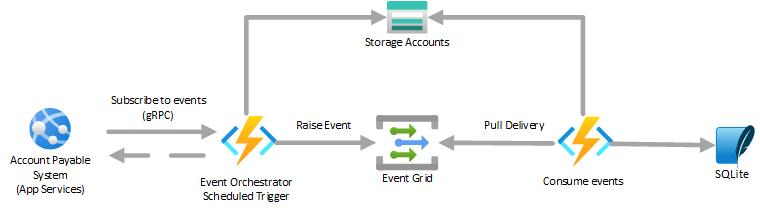

# Event handling using Azure Event Grid Pull model delivery
## Introduction  

The purpose of this demo is to show how Azure Function and Event Grid's Pull delivery model can be used to pulled events from gRPC enabled endpoint and then consume events.

  
## Scenario  

ABC company uses APS (Accounts Payable System) which is SaaS, to payout invoices for their customers. The payout details needs to synced to custom built CRM application which is hosted in Azure.

APS system raises events for every transaction and inforfmation in event can be more then 1 MB in size. APS system exposes enpoint which is based on gRPC to which applications can subscribe to receive events.

## Solution  

In our solution we will be using Azure Functions and Event Grid to consume events. Using claim check pattern will be better option as payload size of event raised by APS system can be more than 1 MB.

There will be two Azure Function apps. Function App for Event Orchestration will subscribe to APS gRPC based endpoint and save event payload in Blob storage and push event containg payload file name to Event Grid's custom topic. These events will then be consumed and processed by second function app using pull delivery.

<b>Note:</b> For the sake of demonstration, in our solution we will be using SQLite (in-memory) to store infomration.

