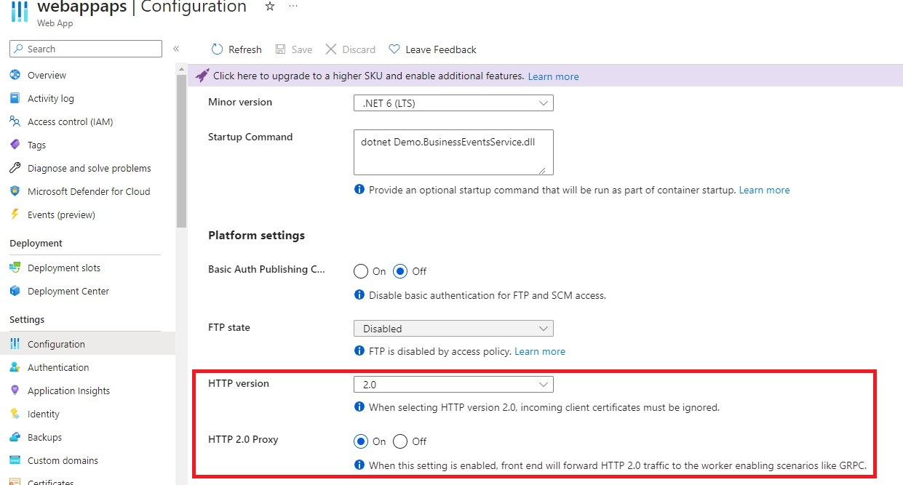
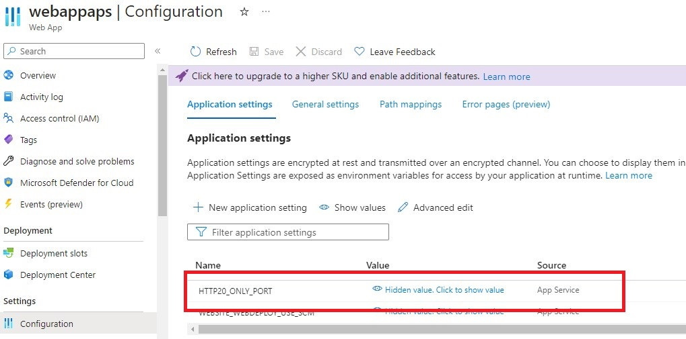
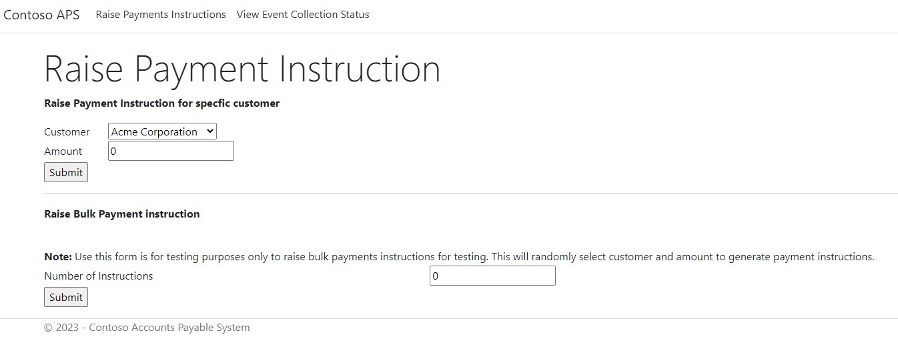
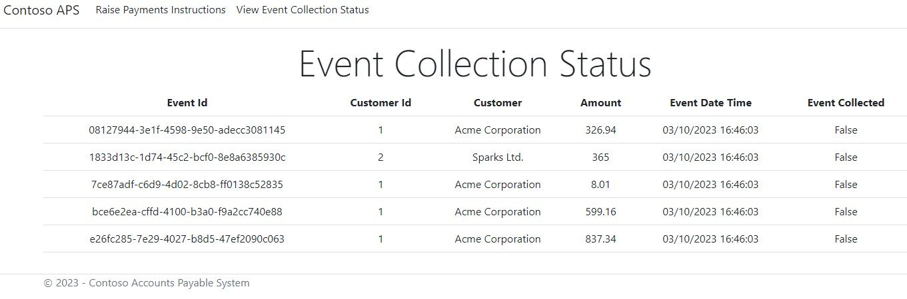
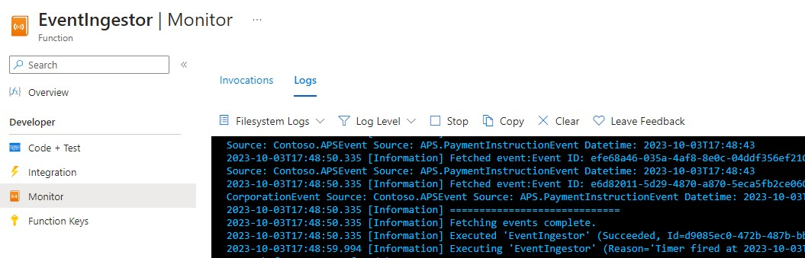
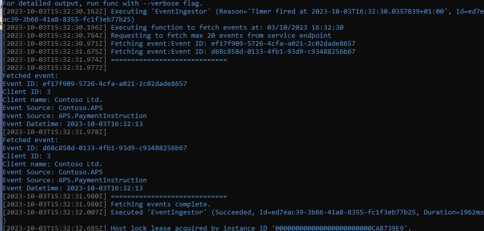
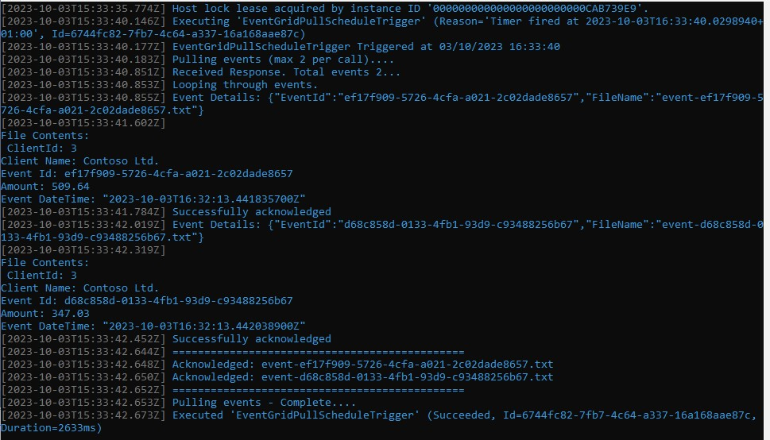

# Event handling using Azure Event Grid Pull model delivery
## Introduction  

The purpose of this demo is to show Event Grid's Pull delivery model to consume events at own pace. The demo uses Azure Function to fetch events from Accounts Payable System which has gRPC enabled service endpoint and push it to Event Grid's namespace custom events. Azure Function then uses Event Grid's pull deliveyr model to consume events.

This demo is uses .Net 6 core framework and also demonstrates how to build gRPC enabled service using .Net 6 Core.

## Prerequistes
* Azure Subscription
* Visual Studio 2022
* .Net Core 6.0

## Azure Components
* <a href="https://learn.microsoft.com/en-us/azure/app-service/overview">App Service</a>
* <a href="https://learn.microsoft.com/en-us/azure/azure-functions/functions-overview?pivots=programming-language-csharp">Function App</a>
* <a href="https://learn.microsoft.com/en-us/azure/event-grid/overview">Event Grid</a>
* <a href="https://learn.microsoft.com/en-us/azure/storage/common/storage-account-overview">Storage account</a>
  
## Scenario  

Contoso company uses APS (Accounts Payable System) which is SaaS product, to payout invoices for their customers. Payment instructions are raised end of each month for various customers and these are more than 10,000. The payment instructions of customers needs to updated in custom built CRM application which is hosted in Azure, and these updates need to happen once a day.

APS system raises events for each payment instruction and events can be more than 10,000 per month. Information in the event is more than 1 MB in size which includes infomration about customer and payment.

 To fetch events from APS system, it exposes HTTP enpoint which is based on gRPC and maximum timeout is 2 mins. Applications can subscribe to receive events to this endpoint and have option to provide number of events they would like receive when requesting.

## Constraints Identified  

 Before designing solution we will list out constraints.

* Max timeout for APS service end point is 2 mins.
* Minimum 10,000 events end of each month.
* Inernal CMS system needs to be synced once a day.

## Solution  

APS system publishes more than 10,000 events end of each month and these events are collected via gRPC enabled service endpoint which is HTTP based. One constraint is that we cannot keep service endpoint open for more than 2 mins. Information in internal CMS system needs to updated with the information in event once a day and it can take some time to cosume events and tranform information. This can eventually make service endpoint timeout leaving information not synced with internal CMS system.

In our solution we will be use Azure Functions with Event Grid to consume events. The information about event from  APS Sytem will be more than 1 MB, it will good to use claim check pattern which will allow us to offload information into blob storage and use Event Grid to pull events.

There will be two Azure Function apps. Function App for Ingesting events which will subscribe to APS gRPC based endpoint and save event payload in Blob storage and push event containg payload file name to Event Grid's custom topic. These events will then be consumed and processed by second function app using event grid's pull delivery model.

<b>Note:</b> For the purpose of demonstration, in our solution we will be using SQLite (in-memory) to store infomration.

## Solution Layout
|Service|Project|Details|
|-----|-----|-----|
|Contoso APS Web App|Demo.BusinessEventsService|Contoso APS system built using Asp.Net MVC which implements gRPC based service and User Interface for management.|
|Event Ingestor|Demo.EventIngestor|Function app which pulls events from Demo gRPC service and push events to Event Grid's custom events.|
|Event Consumer|Demo.EventConsumer|Function app which will use event grid's pull delivery functionality to consume events.|  

## Project environment settings  
### Demo.EventIngestor  
|Variable Name|Details|
|-----|-----|
|AEG_TOPIC_ENDPOINT|endpoint of event grid custom topic e.g https://xxx.eastus-1.eventgrid.azure.net|
|AEG_TOPIC_KEY|Event grid Custom Topic Key|
|AEG_TOPIC_NAME|Name of event grid custom topic|
|SERVICE_API_ENDPOINT|End point of app service where Demo.BusinessEventsService is deployed.|
|BLOB_CONNSTR|Connection string of storage account|
|BLOB_CONTAINER_NAME|Name of blob container. Note: if container does not exists code will create it.|
|MAX_EVENTS|Max events to fetch from Contoso APS gRPC service end point.|

### Demo.EventConsumer  
|Variable Name|Details|
|-----|-----|
|AEG_TOPIC_ENDPOINT|endpoint of event grid custom topic e.g https://xxx.eastus-1.eventgrid.azure.net|
|AEG_TOPIC_KEY|Event grid Custom Topic Key|
|AEG_TOPIC_NAME|Name of event grid custom topic|
|AEG_TOPIC_SUBSCRIPTION|Event grid custom topic subscription name|
|BLOB_CONNSTR|Connection string of storage account|
|BLOB_CONTAINER_NAME|Name of blob container. Note: if container does not exists code will create it.|
|MAX_EVENTS|Max events to fetch from event grid.|

## Deployment  

Please note, you can run solution locally using Visual Studio 2022 without creating anyother resources. Hoeverever Event Grid is mandatory.

* Create Event Grid namespace custom events, topic and event subscription using following tutorials  
    * <a href="https://learn.microsoft.com/en-us/azure/event-grid/event-grid-dotnet-get-started-pull-delivery#create-a-namespace-in-the-azure-portal">Create Event Grid namepsace for custom events</a>.

    * <a href="https://learn.microsoft.com/en-us/azure/event-grid/event-grid-dotnet-get-started-pull-delivery#create-a-namespace-topic">Create a namespace topic</a>.
    * <a link="https://learn.microsoft.com/en-us/azure/event-grid/event-grid-dotnet-get-started-pull-delivery#create-an-event-subscription">Create event subscription</a>.
* <a href="https://learn.microsoft.com/en-us/azure/storage/common/storage-account-create?tabs=azure-portal">Creats Storage Account.</a>
* <a href="https://learn.microsoft.com/en-us/azure/storage/blobs/storage-quickstart-blobs-portal#create-a-container">Create Container.</a>
* Create and Deploy App Service
    * Follow <a href="https://learn.microsoft.com/en-us/training/modules/host-a-web-app-with-azure-app-service/3-exercise-create-a-web-app-in-the-azure-portal?pivots=csharp">Create App service (.Net 6).</a> to create app service. Make sure you create app service for Linux Plan.
    * Under Configuration->General settings, make sure to enable select "2.0" for "HTTP version" and select "On" for "HTTP 2.0 Proxy" 
    * Under Configuration->Application setting, add "New application setting" as per image below. 
    * Set all environment variables.
    * Once creaeted, deploy the Demo.BusinessEventsService project. Follow <a href="https://learn.microsoft.com/en-us/azure/app-service/quickstart-dotnetcore?tabs=net70&pivots=development-environment-vs#2-publish-your-web-app">Deploy an ASP.NET web app</a> to deploy using Visual Studio 2022. 
* Create 2 Function Apps, one for Demo.EventIngestor and another for Demo.EventConsumer and deploy.
   * Create function app following <a href="https://learn.microsoft.com/en-us/azure/azure-functions/functions-create-function-app-portal#create-a-function-app">Create your first function in the Azure portal</a>. Make sure to enable application insights to log out information.
   * Set all environment variables.
   * Deploy function to Azure following <a href="https://learn.microsoft.com/en-us/azure/azure-functions/functions-develop-vs?tabs=isolated-process#publish-to-azure">Publish FUnction to Azure</a>

## How to Run and Test

You can either test after deploying to Azure or run locally using visual studio 2022. Below are the steps:

1. <b>Raise Payment Instruction</b>
    
Navigate to url of Demo.BusinessEventsService and you will see screen similar to below. You can either raise intructions indivudually or generate instructions in bulk.
 
2. <b>View Event Collection Status</b>
    
Once payment instruction is raised, you can view the status of events by clicking "View Event Colelction Status". Event collection screen similar to below will provide information if event has been collected or not. "Event Collected" column will indicate if the event has been relayed to client or not.

     

3. <b>Event Ingestor</b>
   
Once you have raised event you can view the logging information in portal for function app. You can go to function and click Monitor to view logging information as per below screen shot. 
   

   
If running locally then logging information will be displayed in the console. Below screen shot which shows logging information.

   
If you are testing locally make sure you have run Event Ingestor (Demo.EventIngestor).
 
      

4. <b>Event Consumer</b>
   
Once Event Ingestor pushes events to Event Grid namespace custom event topic, Event Consumer will fetch the events. You can view the logging information in portal for function app by goining to Monitor section of the function. See point 3 above.

   
If running locally then logging information will be displayed in the console. Below screen shot which shows logging information.

   
If you are testing locally make sure you have run Event Consumer (Demo.EventConsumer).
 
   